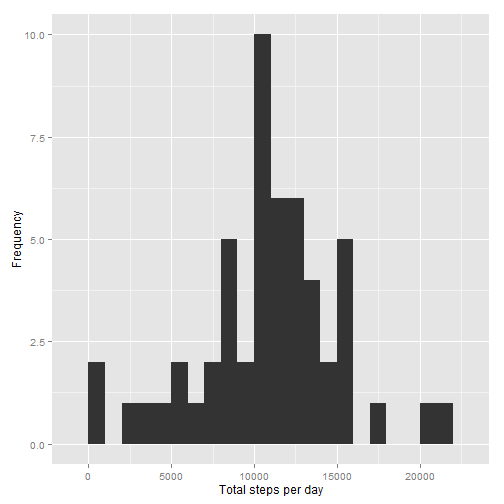
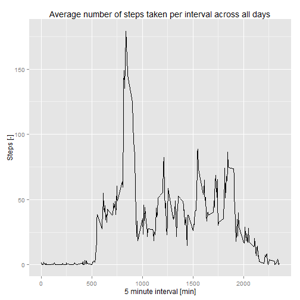
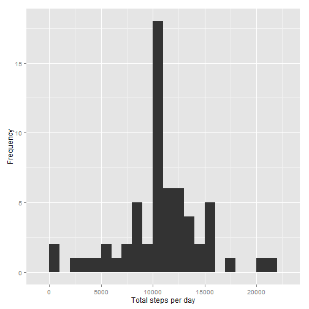
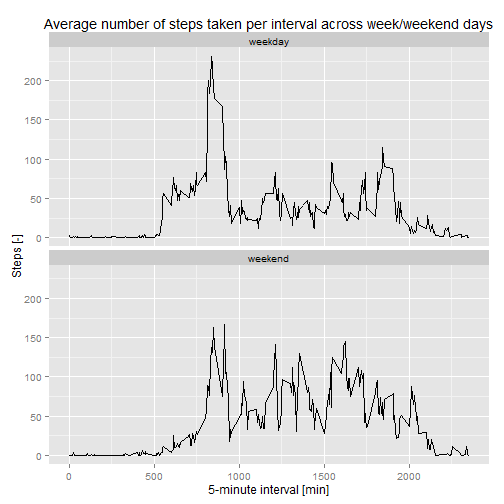

### Preparation
The necessary libraries are installed.


```r
library(ggplot2)
library(data.table)
```

```
## Warning: package 'data.table' was built under R version 3.1.3
```

```
## data.table 1.9.6  For help type ?data.table or https://github.com/Rdatatable/data.table/wiki
## The fastest way to learn (by data.table authors): https://www.datacamp.com/courses/data-analysis-the-data-table-way
```

### Loading and preprocessing data

#### 1. Data import
First, the working directory is set to a personal folder. Then it's checked whether the data file already exists in the folder, if not, the zip file is downloaded from given URL and unzipped to obtain the data file. Subsequently, the data file is imported.


```r
setwd("C:/Users/melmarini/Documents/4. Learning/Coursera/5. Reproducible Research/Course Project 1/Data")

zipfile <- "repdata_data_activity.zip"
file <- "activity.csv"
if(!file.exists(file))
{
  fileURL <-"https://d396qusza40orc.cloudfront.net/repdata%2Fdata%2Factivity.zip"
  download.file(fileURL,destfile = zipfile)
  suppressWarnings(unzip(zipfile))
}

activityData<-read.csv(file=file,sep=",",na.strings="NA")
```

#### 2. Data transformation
The date variable in the activity data set is converted from a factor type to a date type.


```r
activityData$date<-as.Date(activityData$date, format = "%Y-%m-%d")
```

### What is mean total number of steps taken per day?

#### 1. Calculate the total number of steps taken per day
The total number of steps taken per day is calculated with an aggregation of the data set by date, using the data table functionality (available in the data.table package).


```r
dt <- data.table(activityData)
data <- dt[, list(steps=sum(steps)), by=c("date")]
```

#### 2. A histogram of the total number of steps taken each day
The calculated total number of steps taken each day is plotted in a histogram, using the ggplot2 package. 


```r
qplot(data$steps, xlab='Total steps per day', ylab='Frequency', binwidth=1000)
```

 

#### 3. Calculate and report the mean and median of the total number of steps taken per day
The mean and median of the total number of steps are calculated subsequently.


```r
mean(data$steps,na.rm=TRUE)
```

```
## [1] 10766.19
```

```r
median(data$steps,na.rm=TRUE)
```

```
## [1] 10765
```

### What is the average daily activity pattern?

#### 1. Time series plot of the 5-minute interval and the average number of steps taken, averaged across all days
The average number of steps taken per 5-minute interval are calculated across al days, using the data.table package.


```r
activityData$steps[is.na(activityData$steps)]=0
dt <- data.table(activityData)
data <- dt[, list(steps=mean(steps)), by=c("interval")]
```

The average number of steps calculated in the previous step is plotted in a time series plot, using the ggplot2 package.


```r
ggplot(data=data, aes(x=interval, y=steps)) + #data to be plotted
  geom_line(linetype = 1) + #line plot
  xlab("5 minute interval [min]") + #label on x-axis
  ylab("Steps [-]") + #label on y-axis
  ggtitle("Average number of steps taken per interval across all days") #plot title
```

 

#### 2. 5-minute interval containing the maximum number of steps on average across all the days
The interval containing the heighest number of steps is calculated using max() on the previously calculated data set.


```r
gsub("([0-9]{1,2})([0-9]{2})", "\\1:\\2", data$interval[which.max(data$steps)])
```

```
## [1] "8:35"
```

### Imputing missing values

#### 1. Total number of missing values in the dataset
The number of missing values in the original dataset (number of steps variable) is calculated.


```r
setwd("C:/Users/melmarini/Documents/4. Learning/Coursera/5. Reproducible Research/Course Project 1/Data")
activityData<-read.csv(file=file,sep=",",na.strings="NA")
activityData$date<-as.Date(activityData$date, format = "%Y-%m-%d")
sum(is.na(activityData$steps))
```

```
## [1] 2304
```

#### 2. Filling in all of the missing values in the dataset

The missing values are filled in using the mean for the intervals averaged across all days (see previous paragraph). First, these means are calculated and stored in a table. This table is merged with the activity data set. Subsequently, the positions of the missing values are determined. Lastly, these positions are filled with the mean values.


```r
mean_steps <- aggregate(steps ~ interval, data = activityData, FUN = mean)
activity <- merge(activityData, mean_steps, by = "interval", suffixes = c("","_mean"))
activity <- activity[with(activity, order(date, interval)), ]
pos_na <- which(is.na(activityData$steps))
activity$steps[pos_na] <- activity$steps_mean[pos_na]
```

#### 3. New dataset (equal to the original dataset) with the missing data filled in
The activity data set is than created by keeping only first 3 columns of the previously merged table.


```r
activityData <- activity[, c(1:3)]
```

#### 4. Histogram of the total number of steps taken each day and mean + median 
Using the updated data set, the total number of steps taken per day is calculated with an aggregation of the data set by date. The calculated total number of steps taken each day is then plotted in a histogran.


```r
dt <- data.table(activityData)
data <- dt[, list(steps=sum(steps)), by=c("date")]
qplot(data$steps, xlab='Total steps per day', ylab='Frequency', binwidth=1000)
```

 

The mean and median of the total number of steps are calculated subsequently for the updated data set.


```r
mean(data$steps)
```

```
## [1] 10766.19
```

```r
median(data$steps)
```

```
## [1] 10766.19
```

The values do differ slightly comparing the original data set with the updated data set. The values for mean and median are equal after updating the data set.
* Original mean : 10766.19
* Original median: 10765
- New mean : 10766.189
- New median: 10766.189

One can observe that the mean value remains unchanged, while the median value has shifted and matches to the mean. It also seems that the impact of imputing missing values has increase our peak.

### Are there differences in activity patterns between weekdays and weekends?

#### 1. A new factor variable is created indicating two levels - "weekday" and "weekend"
A new variable is joined on the existing table containing the weekdays per row. The weekdays() function has been used to achieve this. 


```r
Sys.setlocale("LC_TIME", "English") ## Sets output of weekdays() function in English
```

```
## [1] "English_United States.1252"
```

```r
activityData$dayflag[weekdays(activityData$date) %in% c("Monday","Tuesday","Wednesday","Thursday","Friday")]<-"weekday"
activityData$dayflag[weekdays(activityData$date) %in% c("Saturday","Sunday")]<-"weekend"
```

#### 2. Panel plot with  time series plots of the 5-minute interval and the average number of steps taken, averaged across all weekday or weekend days
First the data set is aggregated by weekday and interval, thus obtaining the necessary data set to create the necessary plot.


```r
dt <- data.table(activityData)
data <- dt[, list(steps=mean(steps)), by=c("dayflag","interval")]
```

The panel plot consists of 2 time series plots of the 5-minute interval and the average number of steps taken, 1 plot for the week days and the other for the weekend days.


```r
ggplot(data=data, aes(x=interval, y=steps)) +
  geom_line(stat="identity") +
  facet_wrap(~dayflag, nrow=2) + 
  xlab("5-minute interval [min]") +
  ylab("Steps [-]") +
  ggtitle("Average number of steps taken per interval across week/weekend days")
```

 

Activity on weekdays has the greatest peak from all steps intervals. One can also observe that weekends activities have more peaks with more than hundred steps relative to weekday activities. An example of a cause is that activities on weekdays mostly have workrelated routines. In the weekend a better distribution of effort can be seen over time.
